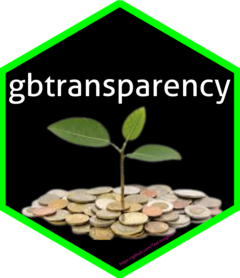

<!-- README.md is generated from README.Rmd. Please edit that file -->

# gbtransparency <a href="https://special-adventure-gq3r94k.pages.github.io/"></a>

<!-- badges: start -->

[](https://github.com/Teal-Insights/gbtransparency/actions/workflows/R-CMD-check.yaml)
[](https://lifecycle.r-lib.org/articles/stages.html#experimental)
[](https://github.com/Teal-Insights/gbtransparency/actions/workflows/test-coverage.yaml)
[](https://codecov.io/gh/Teal-Insights/gbtransparency)
[](https://choosealicense.com/licenses/cc0-1.0/)
[](https://github.com/Teal-Insights/gbtransparency/actions/workflows/pkgdown.yaml)
<!-- badges: end -->

`gbtransparency` is primarily a data package enabling an efficient
method for working with [Green Bond Transparency
datasets](https://www.greenbondtransparency.com/support/resources/) in
R.

### About the Green Bond Transparency datasets:

The Green Bond Transparency(GBTP) has developed a free and public
integrated dataset of all the bond’s information included in the
platform presented in five export-files. `gbtransparency` helps users to
access files. These files are:

1)  `bond's` general information
2)  `allocation` of proceeds to project categories using international
    standards (GBP, CBI)
3)  `measurements` of impact and outcome KPIs
4)  individual bond-`tranche` information
5)  detailed information of the `projects` receiving disbursements.

There is also an additional file named `index`. This shows description
of variable names per data.

### Relevant Notes

1.  **`gbtransparency` is still under heavy development**: Please use
    accordingly. The initial phase of package development aims to
    finalize stable versions of the datasets, and will be announced with
    a new package version release and note. Further development will
    focus on building helper functions to aid efficient analysis
    workflows with the dataset.

2.  **`gbtransparency` is a personal project**: While the package author
    works as a [consultant to
    AidData](https://www.linkedin.com/feed/update/urn:li:activity:7067478837885849600/)
    this package is a personal project. The author built the package for
    his own own use, but hopes that it can grow into a robust package
    that can aid researchers, policymakers, and others interested in
    gaining actionable, empirically-based insights about Green Bond
    Transparency datasets.

### Installation

You can install the development version of `gbtransparency` from
[GitHub](https://github.com/) with:

``` r
# install the `devtools` package if not yet installed
# install.packages("devtools")

# install gbtransparency from GitHub
devtools::install_github("Teal-Insights/gbtransparency")
```

This package will likely never be published on
[CRAN](https://cran.r-project.org/) because the data file sizes are too
big.

### Using gbtransparency package

The datasets in the packages are as follow:

| package_data_name              | website_data_description                                                              |
|:-------------------------------|:--------------------------------------------------------------------------------------|
| gbt_allocations                | allocation of proceeds to project categories using international standards (GBP, CBI) |
| gbt_bonds                      | bond’s general information                                                            |
| gbt_key_performance_indicators | measurements of impact and outcome KPIs                                               |
| gbt_projects                   | detailed information of the projects receiving disbursements                          |
| gbt_tranches                   | individual bond-tranche information                                                   |
| gbt_data_dictionary            | index (description of variable names per data.)                                       |

Now we can have a look at the first six observations per data

``` r
library(gbtransparency)
```

#### a) `gbt_allocations`: allocation of proceeds to project categories using international standards (GBP, CBI)

``` r
utils::head(x = gbt_allocations) %>% knitr::kable()
```

| bond_handle                      | bond_name                | nomenclature                                    | category         | subcategory | project         | location | date_allocation | date_disbursement | allocation_currency | allocated_allocation_currency | disbursed_allocation_currency | bond_currency | disbursed_bond_currency | disbursed_usd | refinancing | cofinancing_percentage |
|:---------------------------------|:-------------------------|:------------------------------------------------|:-----------------|:------------|:----------------|:---------|:----------------|:------------------|:--------------------|------------------------------:|------------------------------:|:--------------|------------------------:|--------------:|:------------|-----------------------:|
| 1fd5c178da6148569a42c52f45981714 | Bancolombia Bono Verde 1 | Climate Bonds Initiative Project Classification | Energy           | Hydro       | GB 1 Proyecto 1 | Colombia | 2016-12-05      | 2016-12-05        | COP                 |                    5271430000 |                    5271430000 | COP           |              5271430000 |       1722104 | TRUE        |                   0.92 |
| 1fd5c178da6148569a42c52f45981714 | Bancolombia Bono Verde 1 | ICMA Green Bonds Principles Project Categories  | Renewable energy | Generation  | GB 1 Proyecto 1 | Colombia | 2016-12-05      | 2016-12-05        | COP                 |                    5271430000 |                    5271430000 | COP           |              5271430000 |       1722104 | TRUE        |                   0.92 |
| 1fd5c178da6148569a42c52f45981714 | Bancolombia Bono Verde 1 | Climate Bonds Initiative Project Classification | Energy           | Hydro       | GB 1 Proyecto 2 | Colombia | 2016-12-05      | 2016-12-05        | COP                 |                    2488157000 |                    2488157000 | COP           |              2488157000 |        812847 | TRUE        |                   0.92 |
| 1fd5c178da6148569a42c52f45981714 | Bancolombia Bono Verde 1 | ICMA Green Bonds Principles Project Categories  | Renewable energy | Generation  | GB 1 Proyecto 2 | Colombia | 2016-12-05      | 2016-12-05        | COP                 |                    2488157000 |                    2488157000 | COP           |              2488157000 |        812847 | TRUE        |                   0.92 |
| 1fd5c178da6148569a42c52f45981714 | Bancolombia Bono Verde 1 | Climate Bonds Initiative Project Classification | Energy           | Hydro       | GB 1 Proyecto 4 | Colombia | 2016-12-05      | 2016-12-05        | COP                 |                   79175253000 |                   79175253000 | COP           |             79175253000 |      25865474 | TRUE        |                   0.92 |
| 1fd5c178da6148569a42c52f45981714 | Bancolombia Bono Verde 1 | ICMA Green Bonds Principles Project Categories  | Renewable energy | Generation  | GB 1 Proyecto 4 | Colombia | 2016-12-05      | 2016-12-05        | COP                 |                   79175253000 |                   79175253000 | COP           |             79175253000 |      25865474 | TRUE        |                   0.92 |

#### b) `gbt_bonds`: bond’s general information

``` r
utils::head(x = gbt_bonds) %>% knitr::kable()
```

| link                                                                                       | handle                           | isin         | cusip     | figi         | ticker         | name                        | issuer_name                                 | issuer_type             | issuer_jurisdiction | fund  | framework_link                                                                                                      | issuance_date | maturity_date | volume_usd | volume_bond_currency | bond_currency |
|:-------------------------------------------------------------------------------------------|:---------------------------------|:-------------|:----------|:-------------|:---------------|:----------------------------|:--------------------------------------------|:------------------------|:--------------------|:------|:--------------------------------------------------------------------------------------------------------------------|:--------------|:--------------|-----------:|---------------------:|:--------------|
| <https://www.greenbondtransparency.com/bond-info/?handle=826fb91751eb4970ac578c6e8f0929fc> | 826fb91751eb4970ac578c6e8f0929fc | US00105DAG07 | 00105DAG0 | BBG00QGRGP11 | NA             | AES Gener Green Bond        | AES Andes                                   | Non-Financial Corporate | Chile               | FALSE | NA                                                                                                                  | 2019-10-07    | 2079-10-07    |  450000000 |             4.50e+08 | USD           |
| <https://www.greenbondtransparency.com/bond-info/?handle=270dc78108554e578876030bd2496dde> | 270dc78108554e578876030bd2496dde | BRVERTCRA2K6 | NA        | NA           | NA             | CRA ComBio Green Bond 2028  | ComBio Energia                              | Non-Financial Corporate | Brazil              | FALSE | NA                                                                                                                  | 2021-11-23    | 2028-11-16    |   26572188 |             1.50e+08 | BRL           |
| <https://www.greenbondtransparency.com/bond-info/?handle=ca95780fd934421fa99ce5cb0b1f71d2> | ca95780fd934421fa99ce5cb0b1f71d2 | US210314AB60 | 210314AB6 | BBG00NW1PM87 | NA             | ISA CTM                     | ISA CTM - Consorcio Transmantaro S.A.       | Non-Financial Corporate | Peru                | FALSE | <https://www.greenbondtransparency.com/download-document/?entity=Framework&handle=905be24bcdf943969c19e593cecd74e1> | 2019-04-16    | 2034-04-16    |  600000000 |             6.00e+08 | USD           |
| <https://www.greenbondtransparency.com/bond-info/?handle=91d5f951533040578939c60b74089a81> | 91d5f951533040578939c60b74089a81 | NA           | NA        | NA           | CAF GB Program | Green Bond Program          | CAF - Banco de Desarrollo de America Latina | Development Bank        | Supranational       | TRUE  | <https://www.greenbondtransparency.com/download-document/?entity=Framework&handle=20ab6a5a7a89447fa8ffc6208696d342> | NA            | NA            |         NA |                   NA | USD           |
| <https://www.greenbondtransparency.com/bond-info/?handle=de08d71d4fcd410eac1c1c388f5743cc> | de08d71d4fcd410eac1c1c388f5743cc | BRRANIDBS031 | NA        | NA           | RANI14         | Irani Green Bond 2029       | Irani Papel e Embalagem S.A.                | Non-Financial Corporate | Brazil              | FALSE | NA                                                                                                                  | 2021-03-31    | 2029-12-15    |   10531304 |             6.00e+07 | BRL           |
| <https://www.greenbondtransparency.com/bond-info/?handle=33ceef813ef14aac8ab44dc3a53606d8> | 33ceef813ef14aac8ab44dc3a53606d8 | COB07CB00611 | NA        | NA           | NA             | Bancolombia Bono Sostenible | Grupo Bancolombia                           | Financial Corporate     | Colombia            | FALSE | <https://www.greenbondtransparency.com/download-document/?entity=Framework&handle=e7161c8807ca44e085439ddf548d7489> | 2019-07-19    | 2024-07-19    |  206408402 |             6.57e+11 | COP           |

#### c) `gbt_key_performance_indicators`: measurements of impact and outcome KPIs

``` r
utils::head(x = gbt_key_performance_indicators) %>% knitr::kable()
```

| bond_handle                      | bond_name                | nomenclature                                    | category         | subcategory | project           | location  | indicator     | unit       | planned_value | measured_value | can_be_aggregated | methodology_code | measurement_period_start | measurement_period_end |
|:---------------------------------|:-------------------------|:------------------------------------------------|:-----------------|:------------|:------------------|:----------|:--------------|:-----------|--------------:|---------------:|:------------------|:-----------------|:-------------------------|:-----------------------|
| 65809b95fbf34e898b30b546b2d2a6a8 | AES Argentina Green Bond | ISO                                             | Other            | Unspecified | Vientos Neuquinos | Argentina | tCO2e avoided | metric ton |         67584 |          67804 | TRUE              | NA               | 2020-10-01               | 2020-12-31             |
| 65809b95fbf34e898b30b546b2d2a6a8 | AES Argentina Green Bond | EU Taxonomy Green Bonds Standard                | Other            | Unspecified | Vientos Neuquinos | Argentina | tCO2e avoided | metric ton |         67584 |          67804 | TRUE              | NA               | 2020-10-01               | 2020-12-31             |
| 65809b95fbf34e898b30b546b2d2a6a8 | AES Argentina Green Bond | ICMA Green Bonds Principles Project Categories  | Renewable energy | Generation  | Vientos Neuquinos | Argentina | tCO2e avoided | metric ton |         67584 |          67804 | TRUE              | NA               | 2020-10-01               | 2020-12-31             |
| 65809b95fbf34e898b30b546b2d2a6a8 | AES Argentina Green Bond | Climate Bonds Initiative Project Classification | Energy           | Wind        | Vientos Neuquinos | Argentina | tCO2e avoided | metric ton |         67584 |          67804 | TRUE              | NA               | 2020-10-01               | 2020-12-31             |
| 826fb91751eb4970ac578c6e8f0929fc | AES Gener Green Bond     | ISO                                             | Other            | Unspecified | Wind Projects     | Chile     | tCO2e avoided | metric ton |        140982 |         157700 | TRUE              | NA               | 2020-01-01               | 2020-12-31             |
| 826fb91751eb4970ac578c6e8f0929fc | AES Gener Green Bond     | EU Taxonomy Green Bonds Standard                | Other            | Unspecified | Wind Projects     | Chile     | tCO2e avoided | metric ton |        140982 |         157700 | TRUE              | NA               | 2020-01-01               | 2020-12-31             |

#### d) `gbt_projects`: detailed information of the projects receiving disbursements

``` r
utils::head(x = gbt_projects) %>% knitr::kable()
```

| bond_handle                      | bond_name                    | nomenclature                                    | category         | subcategory | project                             | parent_project_handle | location |  latitude | longitude | host_organisation  | refinancing | cofinancing_percentage | represented_projects | description                                                                                                                                                                                    |
|:---------------------------------|:-----------------------------|:------------------------------------------------|:-----------------|:------------|:------------------------------------|:----------------------|:---------|----------:|----------:|:-------------------|:------------|-----------------------:|---------------------:|:-----------------------------------------------------------------------------------------------------------------------------------------------------------------------------------------------|
| 9fc875791e3143a1bb3f864a304e8185 | Green Bond 2017 - Davivienda | ISO                                             | Other            | Unspecified | Residential Building \#20           | NA                    | Colombia |        NA |        NA | Anonymous          | FALSE       |                      1 |                   NA | EDGE                                                                                                                                                                                           |
| 9fc875791e3143a1bb3f864a304e8185 | Green Bond 2017 - Davivienda | EU Taxonomy Green Bonds Standard                | Other            | Unspecified | Residential Building \#20           | NA                    | Colombia |        NA |        NA | Anonymous          | FALSE       |                      1 |                   NA | EDGE                                                                                                                                                                                           |
| 9fc875791e3143a1bb3f864a304e8185 | Green Bond 2017 - Davivienda | ICMA Green Bonds Principles Project Categories  | Green buildings  | Residential | Residential Building \#20           | NA                    | Colombia |        NA |        NA | Anonymous          | FALSE       |                      1 |                   NA | EDGE                                                                                                                                                                                           |
| 9fc875791e3143a1bb3f864a304e8185 | Green Bond 2017 - Davivienda | Climate Bonds Initiative Project Classification | Buildings        | Residential | Residential Building \#20           | NA                    | Colombia |        NA |        NA | Anonymous          | FALSE       |                      1 |                   NA | EDGE                                                                                                                                                                                           |
| fd47a3cbf44c4c7bb9c69c5ad3fcc8e0 | CBI Certified Portfolio      | ICMA Green Bonds Principles Project Categories  | Renewable energy | Generation  | Construction of Photovoltaic System | NA                    | Chile    | -40.22497 | -72.39668 | Ministry of Energy | TRUE        |                      1 |                   NA | Construction of 151 individual self-generation systems consisting of a 2.76 kWp PV plant and a 25 kWh battery bank. All systems are located on Huapi Island, Futrono commune, Los Lagos region |
| fd47a3cbf44c4c7bb9c69c5ad3fcc8e0 | CBI Certified Portfolio      | Climate Bonds Initiative Project Classification | Energy           | Solar       | Construction of Photovoltaic System | NA                    | Chile    | -40.22497 | -72.39668 | Ministry of Energy | TRUE        |                      1 |                   NA | Construction of 151 individual self-generation systems consisting of a 2.76 kWp PV plant and a 25 kWh battery bank. All systems are located on Huapi Island, Futrono commune, Los Lagos region |

#### e) `gbt_tranches`: individual bond-tranche information

``` r
utils::head(x = gbt_tranches) %>% knitr::kable()
```

| bond_handle                      | bond_name                               | market        | stock_exchange | tranche_currency | volume_offered_tranche_currency | volume_raised_tranche_currency | bond_currency | volume_raised_bond_currency | volume_raised_usd |
|:---------------------------------|:----------------------------------------|:--------------|:---------------|:-----------------|--------------------------------:|-------------------------------:|:--------------|----------------------------:|------------------:|
| ee7a68239dbe4664adad596c19403c93 | Suzano Papel e Celulose Green Bond 2026 | United States | NA             | USD              |                         5.0e+08 |                        5.0e+08 | USD           |                     5.0e+08 |         500000000 |
| ee7a68239dbe4664adad596c19403c93 | Suzano Papel e Celulose Green Bond 2026 | United States | NA             | USD              |                         2.0e+08 |                        2.0e+08 | USD           |                     2.0e+08 |         200000000 |
| fe8a86a4318f49fb850f1dfa256f263b | GCDMXCB 16V                             | Mexico        | NA             | MXN              |                         1.0e+09 |                        1.0e+09 | MXN           |                     1.0e+09 |          49269093 |
| cffe109b8d59400dbf3b62d9e36c0d76 | GCDMXCB 17X                             | Mexico        | NA             | MXN              |                         2.0e+09 |                        2.0e+09 | MXN           |                     2.0e+09 |         112585354 |
| 0f91b88562524743ad5ecf105cddab89 | Banco Nacional de Costa Rica 2021       | United States | NA             | USD              |                         5.0e+08 |                        5.0e+08 | USD           |                     5.0e+08 |         500000000 |
| 19e36a4428614da782362502bd1291a3 | Attend Ambiental 2026                   | Brazil        | NA             | BRL              |                         5.5e+07 |                        5.5e+07 | BRL           |                     5.5e+07 |          13000000 |

#### f) `gbt_data_dictionary`: index (description of variable names per data.)

``` r
utils::head(x = gbt_data_dictionary) %>% knitr::kable()
```

| data  | ref_no | name   | full_name   | description                                                                                                               |
|:------|-------:|:-------|:------------|:--------------------------------------------------------------------------------------------------------------------------|
| Bonds |   1.01 | link   | Bond link   | Unique link to the bond data in the Green Bond Transparency Platform website.                                             |
| Bonds |   1.02 | handle | Link handle | Unique code of the bond registrered in the Green Bond Transparency Platform showed in the bond link.                      |
| Bonds |   1.03 | ISIN   | ISIN code   | International Securities Identification Number (ISIN) uniquely identifies a security.                                     |
| Bonds |   1.04 | CUSIP  | CUSIP code  | A CUSIP number is a unique identification number assigned to stocks and registered bonds in the United States and Canada. |
| Bonds |   1.05 | FIGI   | FIGI code   | The FIGI code a is global identification based on Bloomberg’s Open Symbology.                                             |
| Bonds |   1.06 | ticker | Ticker code | A stock symbol is an arrangement of characters—usually letters—representing publicly-traded securities on an exchange     |
